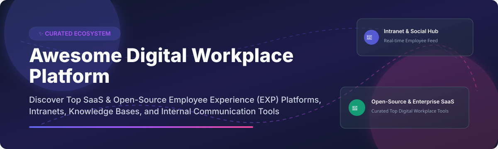

# 🏢 Awesome Digital Workplace Platform 🚀

    

## 🌟 Top Digital Workplace Platform Ecosystem

**A Comprehensive, Curated List of Enterprise SaaS Products & Self-Hosted Open-Source GitHub Projects**  
*Focused on Employee Experience (EXP), Internal Communications, Digital Intranets & Team Collaboration Software*  

📅 **Last updated:** September 2026

---

## 💡 Overview & Market Insights

Digital Workplace Platforms connect employees with company news, internal knowledge bases, enterprise collaboration tools, and peer recognition networks — building a unified intranet and employee experience layer across desk-bound and frontline workforces.

### 📊 Market Size & Industry Dynamics

> 📈 **Estimated Market Size:** The global Digital Workplace Platform & Employee Experience (EXP) market is estimated at **~$38.5 Billion (2026)** and is projected to reach **~$85 Billion by 2032**, growing at a CAGR of ~14.2%.
>
> 🧩 **Market Fragmentation:** The market is **moderately fragmented**, anchored by dominant enterprise giants (such as Microsoft Viva and Zoom/Workvivo) at the high end, while maintaining a rich ecosystem of specialized SaaS suite leaders (Unily, Simpplr, Staffbase) and vibrant open-source alternatives (Nextcloud Hub, AppFlowy, Mattermost) providing complete data sovereignty.

---

## 📑 Table of Contents

- [🏢 Enterprise SaaS & Hosted Platforms](#-enterprise-saas--hosted-platforms)
- [🔓 Open-Source GitHub Projects](#-open-source-github-projects)
- [🤝 How to Contribute](#-how-to-contribute)
- [❤️ Support & Sponsoring](#%EF%B8%8F-support--sponsoring)
- [📈 Star History](#-star-history)
- [⚠️ Disclaimer](#%EF%B8%8F-disclaimer)

---

## 🏢 Enterprise SaaS & Hosted Platforms

The table below lists top enterprise SaaS Digital Workplace and Employee Experience Platforms, sorted by **Company Size / Valuation / Revenue (Descending)**.

| Platform 🚀 | Description 📝 | Company Size / Valuation / Revenue 🏢 | Starting Pricing Tier 💰 | Free Tier / Trial Limit ⏳ |
| :--- | :--- | :--- | :--- | :--- |
| **[Microsoft Viva](https://www.microsoft.com/microsoft-viva)** | Integrated employee experience platform built on Microsoft 365 & Teams. Modules include Viva Connections, Engage, Amplify, Insights, Learning, Goals, Glint, and Pulse. | **~$3.1 Trillion Market Cap** (Microsoft parent) | **$2.00 / user / month** (Viva Suite add-on; req. M365) | 1-month Free Trial (up to 25 licenses) |
| **[Workvivo](https://workvivo.com/)** | Engagement-first social intranet and employee app with consumer-grade feel. Acquired by Zoom in 2023; preferred migration path for Workplace from Meta. | **~$22 Billion Market Cap** (Zoom parent) | **$20.00 / user / year** (~$1.67/mo per employee) | 30-day Free Trial (custom scope) |
| **[Staffbase](https://staffbase.com/)** | Employee experience platform known for powerful mobile app capabilities, internal communications, and intranet integration. | **Valuation: ~$1.1 Billion** (Unicorn status) | **$3.00 / user / month** (Starter plan estimate) | 14-day Free Trial |
| **[LumApps](https://www.lumapps.com/)** | AI-powered digital workplace offering seamless integration across Microsoft 365 and Google Workspace with employee advocacy tools. | **Valuation: ~$650 Million** (Acquired by Bridgepoint) | **$4.00 / user / month** (Base seat tier) | 14-day Free Trial |
| **[Simpplr](https://www.simpplr.com/)** | AI-powered employee experience platform with clean UI, personalized internal communications, and smart analytics. | **Valuation: ~$500 Million** ($70M+ Series D raised) | **$8.00 / user / month** (Standard seat estimate) | 14-day Free Trial |
| **[Unily](https://www.unily.com/)** | Enterprise digital workplace and intranet platform known for advanced analytics, multi-channel targeting, and global scalability. | **Valuation: ~$450 Million** (CVC Capital Partners backed) | **$3.50 / user / month** (Enterprise tier rate) | 14-day Free Trial |
| **[Haiilo](https://www.haiilo.com/)** | Employee communications platform combining social intranet, advocacy, and employee survey insights (formerly COYO). | **Annual Revenue: ~$50 Million** | **$4.50 / user / month** (Starter package) | 14-day Free Trial |
| **[Igloo Software](https://www.igloosoftware.com/)** | Digital workplace platform featuring intranet portals, knowledge management, and team collaboration. (Acquired by Appspace 2025). | **Annual Revenue: ~$40 Million** | **$3.00 / user / month** (Digital Workplace seat) | 14-day Free Trial |
| **[Workspace 365](https://www.workspace365.com/)** | Unified digital workplace portal aggregating web apps, documents, and company communications into a single browser hub. | **Annual Revenue: ~$18 Million** | **$3.25 / user / month** (Basic workspace seat) | 30-day Free Trial |
| **[Interact](https://www.interactsoftware.com/)** | Intelligent intranet software designed for enterprise internal communications, knowledge discovery, and employee engagement. | **Annual Revenue: ~$15 Million** | **$4.00 / user / month** (Standard tier estimate) | 14-day Free Trial |

---

## 🔓 Open-Source GitHub Projects

Self-hosted open-source software provides full data sovereignty, privacy compliance, and vendor independence for digital workplaces. The list below is sorted by **GitHub Star Count (Descending)**.

| Star Badge ⭐ | Project & Repository 📦 | Description 🎯 | Key Features & Stack 🛠️ |
| :--- | :--- | :--- | :--- |
|  | **[AppFlowy](https://github.com/AppFlowy-IO/AppFlowy)** | Open-source Notion alternative for workplace wikis, document collaboration, and project management. | Flutter, Rust, SQLite/PostgreSQL, offline-first architecture, end-to-end encryption. |
|  | **[Mattermost](https://github.com/mattermost/mattermost-server)** | Enterprise-grade open-source collaboration suite featuring secure team messaging, audio calls, and workflow automation. | Go, React, PostgreSQL/MySQL, Microsoft Teams alternative, sovereign deployment. |
|  | **[Nextcloud Hub](https://github.com/nextcloud/server)** | The leading European sovereign workplace alternative to Microsoft 365. File sync, Office, Talk, Groupware, and AI Assistant. | PHP, JavaScript, PostgreSQL/MariaDB, AGPL-3.0, Org charts, Sensitivity Labels. |
|  | **[Zulip](https://github.com/zulip/zulip)** | Open-source real-time team chat with unique threaded conversations for structured workplace communication. | Python, Django, TypeScript, PostgreSQL, powerful search, integrations API. |
|  | **[OpenProject](https://github.com/opf/openproject)** | Open-source enterprise project management and workplace collaboration software with agile boards and Gantt charts. | Ruby on Rails, Angular, PostgreSQL, project roadmaps, work package tracking. |
|  | **[HumHub](https://github.com/humhub/humhub)** | Flexible open-source social intranet kit designed for corporate social networks, employee communication, and team spaces. | PHP, Yii2 framework, MySQL/MariaDB, 70+ modules (Messenger, Wiki, Polls, LDAP). |
|  | **[Twake Workplace](https://github.com/twakeapp/twake)** | European sovereign digital workplace platform featuring Matrix chat, drive, team calendars, and document editing. | TypeScript, React, Node.js, Matrix protocol, LinTO AI meeting transcription. |
|  | **[XWiki Platform](https://github.com/xwiki/xwiki-platform)** | Powerful open-source enterprise wiki and knowledge management platform for building internal company intranets. | Java, Solr, Hibernate, extensible architecture, fine-grained access control. |
|  | **[TwakeAI (LINAGORA)](https://github.com/linagora/twake-workplace)** | Sovereign open-source collaborative suite with integrated AI models, meeting summary bot, and document management. | Vue.js, Node.js, Matrix, JMAP, SecNumCloud compliance design. |
|  | **[eXo Platform](https://github.com/exoplatform/platform)** | Sovereign open-source digital workplace & social intranet serving public sectors (Elysée Palace, US DoD, Inria). | Java 21, Spring Boot 3.1, ElasticSearch 8, OnlyOffice 9, PWA support. |
|  | **[Simoona Intranet](https://github.com/VismaLietuva/simoona)** | Production-ready social intranet built by Visma, featuring employee wall feeds, org directory, and gamified peer kudos. | C#, ASP.NET MVC, AngularJS, Entity Framework, Docker deployment. |
|  | **[Kherad](https://github.com/mohammadmaso/kherad)** | Self-hosted, git-backed knowledge base with Notion-like block editor, AI review agents, and source-cited RAG chat. | TypeScript, Fastify, Next.js, Turborepo, PostgreSQL full-text search. |
|  | **[CompanyDirectory-v2](https://github.com/joaojmendes/CompanyDirectory-v2)** | AI-powered SPFx employee directory & interactive org chart for SharePoint, using Azure OpenAI & MS Graph. | SPFx, React, TypeScript, Azure OpenAI, MS Graph OData, IndexedDB cache. |

### 🛠️ Frameworks & Component Libraries for Custom Workplaces

- 👤 **[OS GIR (Global Identity Repository)](https://github.com/OS2gir)** — Open-source identity & organization directory management system keeping track of departments, personnel hierarchy, and automated sync.
- ⚙️ **[@mecra/foundation-people](https://github.com/mecra)** — Foundation People Core engine providing CRUD, org chart hierarchy, search, and KPI primitives for digital workplace platforms.
- 🧠 **[WeKnoraLite](https://github.com/WeKnora)** — Open-source LLM knowledge platform converting corporate documents into queryable RAG agents and self-maintaining wiki graphs.

---

## 🤝 How to Contribute

We welcome contributions from HR leaders, IT admins, and open-source developers!

1. 🍴 **Fork** this repository.
2. ➕ **Add/Edit** entries in `README.md` following the table structure above.
3. 📝 Ensure all links are official, factual, and include relevant star links or pricing metrics.
4. 📬 **Submit a Pull Request (PR)** with a clear title and description.

---

## ❤️ Support & Sponsoring

Thank you for exploring and using **Awesome-Digital-Workplace-Platform**! If you find this curated list helpful for your organization, team, or personal research, please consider supporting the project:

- ⭐ **Star this repository** on GitHub to help others discover it.
- 🍴 **Fork and share** it with fellow HR leaders, IT architects, and developers.
- ☕ **Buy me a coffee / Sponsor**: If you'd like to support ongoing maintenance and new list additions, visit the [GitHub Sponsor Dashboard](https://github.com/sponsors/ishandutta2007).

Your support is deeply appreciated! 🙌

---

## 📈 Star History

---

## ⚠️ Disclaimer

- This repository is a **community-curated list** for informational and research purposes only.
- Self-hosting open-source intranet platforms requires proper security practices, server hardening, and compliance with data privacy regulations (GDPR, CCPA, HIPAA).
- Product pricing and financial estimations are subject to vendor updates; always verify with official sales channels.

---

<b>Made with ❤️ for HR leaders, internal communications managers, IT architects, and workplace technology teams worldwide.</b>

